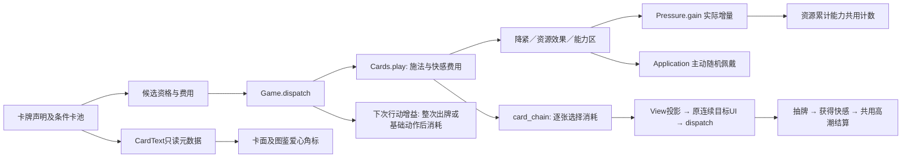
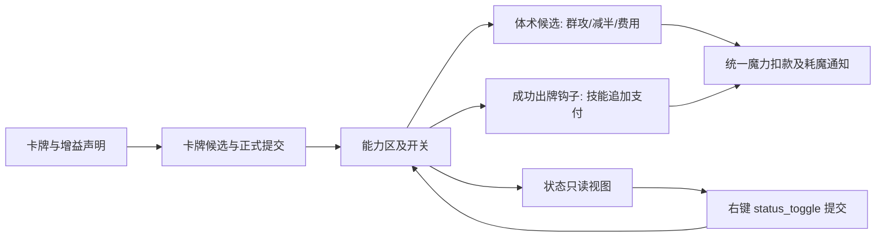
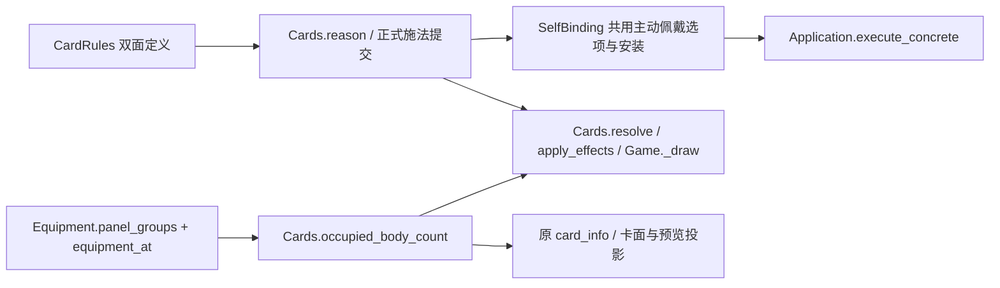
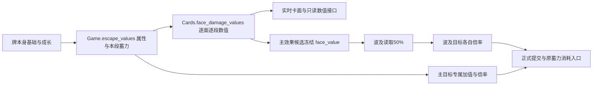
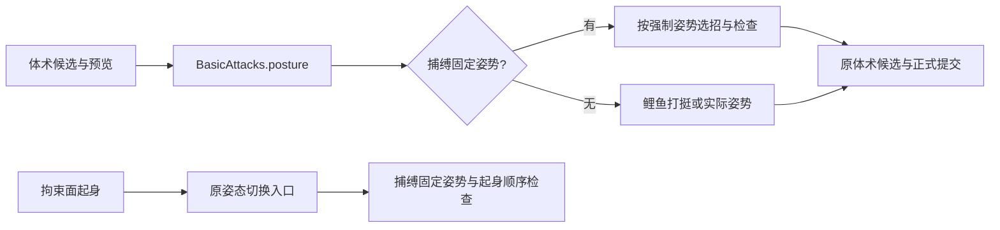

# 卡牌真源

本文件是卡牌定义、卡池、关键词、牌区生命周期、能力增益与卡牌音乐的唯一真源。机械定义只来自 `data/card_rules.gd::SPECS/BUFFS` 与 `core/card_effects.gd`；卡面与图鉴文案读 `data/balance.gd::CARD_INFO/CARD_NAMES/CARD_TRAITS`。共用的施法成功率、耗魔与资源规则见 `./game-design.md`；角色2 的专属改单见 `./character-two.md`；内容包字段见 `./content.md`（外部内容包不支持卡牌 JSON，新增卡必须改源码）。

## 1. 分类、费用与卡池

### 淫魔法卡池

以下卡牌及本批后续卡牌均属于 `reward_pool="lewd_magic"`，持有欲望魔方 Pro Max 后按当前角色的卡牌兼容规则开放；技能与能力保留自身类型。基础牌不加入普通奖励。淫魔法是魔法的子类，右上角用爱心显示快感费用（无快感费用时只显示爱心）；适用 [快感施法曲线](game-design.md#43-施法成功率本规则只写在此处)。没有另行指定部位的淫魔法不增加身体部位条件。

| 卡牌 | 类型／稀有度 | 拘束面 | 自由面 |
| --- | --- | --- | --- |
| 心痒难耐 | 淫魔法／基础 | 1能量、10快感，降紧1 | 1能量，随机佩戴一件初级性玩具 |
| 自我满足 | 技能／普通 | 0能量、10魔力，获得20快感 | 1能量，获得10快感、蓄力2 |
| 心理暗示 | 淫魔法／普通／保留 | 1能量、20快感，下次出牌或基础动作忽略拘束具造成的使用限制、施法倍率与威力削减 | 0能量、10快感，抽1张牌、蓄力1 |
| 强打精神 | 技能／普通 | 0能量，降紧1，获得10快感 | 1能量，失去20快感，下回合开始获得40快感 |
| 爱欲魔纹 | 能力／罕见，无需施法判定 | 1能量、30快感；每实际获得30快感，蓄力1 | 2能量、30快感；每实际获得40快感，抽1张牌 |
| 强制寸止 | 淫魔法／稀有 | 0能量、20快感，能量＋1 | 1能量、10魔力，抽2张牌，失去20快感 |
| 强制高潮 | 淫魔法／稀有／消耗 | 1能量，选择3张牌消耗 → 抽3张牌 → 获得30快感 → 触发一次不改变快感值的高潮 | 同拘束面 |

- 选择 Pro Max 时，以“心痒难耐”替换卡组中的“魔力撑隙”，沿永久卡牌替换同步各牌区。
- 快感费用足额才可使用，以支付前快感判施法；施法失败全额返还快感，能量与留牌遵循既有规则。快感费用不受增长倍率影响，不算“获得快感”。
- 心理暗示只消耗在下一次正式出牌或基础动作，失败尝试也消耗；切牌面、选目标、查看、道具、移动和姿势不消耗。不绕过姿势、快感、费用、目标锁及外层覆盖规则。整次多段行动共用一次豁免。
- 强制高潮从本场抽牌堆、手牌、弃牌堆逐张选择三张，不含自身、已消耗及已生效能力；不删除永久牌。少于三张时不可支付。整次只施法、付款一次，中途选择可存档。获得30快感仍可触发自然高潮；随后指定的一次高潮保留当时快感，其他高潮后果与装备判定照常。
- 主动佩戴使用初级随机性玩具正式池及默认2档，不替换已有装备，也不消耗闪避；无合法位置时不可打出。
- 爱欲魔纹两面进度分别累计、跨回合保留，战斗结束清除；倍率、保护封顶后的实际增量计入，过载回落与支付／降低不扣除进度。强打精神的延迟增量在下回合开始一次结算，多次使用分别累计，场次结束清除。



### 活动媚肉

- 罕见技能牌，0费，无需施法；正常弃置，不附加消耗或保留。
- 拘束面获得4点临时灵巧，自由面获得2点临时力量。本回合有效；重复使用叠加，两面共存。自由面沿原休息限制，拘束面沿原复放规则。
- 复用回合增益的层数、属性计算及清理：`self_faces.buff → grant_buff/card_buff_uses → buff_stacks/power_attribute_modifier → RelicEffects.attribute`。既有回合结束与整备离场入口清除增益及层数；不新增存档字段。

### 拘束就是力量！

- 普通技能牌，1费，消耗，双拘束面；无需施法或指定身体目标。
- 拘束1：获得⌊当前佩戴拘束具件数÷2⌋点临时力量，立即生效，直到你的下回合结束前。重复打出叠加，跨回合获得的力量各自到期。
- 拘束2：获得⌊当前佩戴拘束具件数÷4⌋层蓄力，保留与消耗沿现有蓄力规则。
- 沿用汇流的统一计数：普通装备按件、复合按整件、特殊装备计入，链接不另计；两面实时计算并向下取整。零收益仍可出牌并正常付费消耗；两面均按拘束效果参与既有复放，不额外支付或重复消耗实体牌。
- 实现路径：`bound_modes/self_faces → worn_count/worn_gain → 现有self结算 → grant_buff/_gain_charge → 原消耗区`；拘束1按收益授予力量增益层数，当前阶段的 `next_turn_start` 增益在下回合开始时逐层转为 `turn` 增益，由既有回合结束入口清除。属性沿 `power_attribute_modifier → RelicEffects.attribute` 汇总；同一计数结果用于卡面实时预览，无新增存档字段。

### 魔力附着

- 罕见魔法／能力牌，1能量、10魔力，无部位施法；成功打出任一面获得1层蓄力。
- 自由：本场体术额外支付10魔力，改为全体伤害，最终基础伤害减半（含力量、蓄力与既有体术乘区）。一次完整攻击只支付一次；不足10魔力时恢复原招式的伤害和目标范围。火球术不受影响。
- 拘束：本场每成功打出一张技能牌，额外支付5魔力并获得1层蓄力；魔法／技能双标签也计入。魔力不足时跳过，不部分支付；失败、复放、连续段不重复触发。
- 追加费用固定，优先支付临时魔力，再支付自身魔力；计入既有耗魔联动，不再判施法。
- 两面各自唯一，可共存；状态图标右键独立开关，关闭后仍显示，可再开启。开关随能力区存档，沿用本场能力的清理时点。

实现通道：卡牌声明 → 正式候选／提交 → 能力区；体术候选读取当前开关与可支付魔力；出牌完成钩子结算技能追加支付。统一付款入口通知既有耗魔效果，状态视图不写规则状态。



### 紧缚检索

- 罕见魔法／技能牌，1能量、10魔力，两面均为无部位施法。
- 自由：在非性器部位随机佩戴1件紧度2的中级普通拘束具，随后抽3张牌。沿用自缚的主动佩戴，不触发闪避／蓄力抵挡、不替换已有装备；无合法位置时不能使用。随机池使用普通装备生成名单，不生成特殊装备、链接或复合装备。
- 拘束：抽⌊X/2⌋张，X为有拘束具的非性器身体栏小部位数，实时显示与结算。左右、同部位多件不重复；颈肩、手部、足部分别合并；复合装备按真实覆盖的各小部位计数，性器区域的三个特殊部位均排除。X为0或1时可使用但不抽牌。
- 两面成功后正常弃置；失败沿原施法流程结算，既不佩戴也不抽牌。



类型与稀有度是两条独立分类，不能用名称、费用或插图推断。

| 类型 | 基础 | 普通 | 罕见 | 稀有 |
| --- | --- | --- | --- | --- |
| 技能 | 用力！、顾涌！ | 鲤鱼打挺、预备咏唱、汇流、借力打力、运气、蓄势待发、翘腿无视、魔路检索、连续挣、余火、绷紧再挣、一点点抽出、强力肘击、魔力涌流、激发魔力、死灰复燃 | 汲取、紧缚检索、自缚、魔路精通、共鸣、魔术手、炫火、猛火下山、拘束之拥、强欲之壶、专心致志、找准松处、扯开缺口、接连挣动、逐层抽离、术式解锁、魔力转换、开信刀play、灵活变通、余势复演、控火 | 命运同担、汲取力量、熟练而已、身轻如燕、灌注、魔力回路、猪神之皇焚、火焰精通、紧缚爱好、欲能转换、henshin、火动力学 |
| 魔法 | 魔力撑隙、魔力松缚 | — | — | — |
| 能力 | — | — | — | 无尽魔法少女战神、交感形态 |
| 诅咒／状态 | 慌乱、敏感、淫纹、玩弄、玩弄+（不进奖励池） | — | — | — |

- 双面卡的两面费用由 `CardRules.energy_cost(type, free)` 计算：基础 `cost`＋该面 `energy_cost`−该面 `energy_discount`，最低0。
- 耗魔由 `face_mana_base` 读取；魔法牌未单独声明时为10（`data/balance.gd::SPELL_COST`）。
- 奖励池 `COMMON/UNCOMMON/RARE` 与 `REWARDS` 在同一数据文件；基础牌与诅咒不自动入池。双重解锁已退出奖励、商店与图鉴，仅保留定义供历史行为测试。

### 1.1 奖励与获取

| 来源 | 普通 | 罕见 | 稀有 |
| --- | ---: | ---: | ---: |
| 普通战斗 | 60% | 37% | 3% |
| 精英 | 50% | 40% | 10% |
| 首领 | 0% | 0% | 100% |

每张展示牌依次掷0—99整数：先比较基础稀有率＋`rare_offset`，再比较加罕见率；`rare_offset` 初始−5，每生成一张普通牌＋1，罕见不变，稀有重置−5，上限＋40；不先把负稀有阈值截为0。出处 `data/card_rules.gd::REWARD_RATES`、`core/card_rewards.gd::rarity/next_offset`。

- 先抽稀有度，再在该稀有度剩余牌中等概率选取，每组三张不重复；获奖、跳过、查看都不重抽。放大镜使奖励可选数＋1（休息房的稀有与罕见两组各冻结4张）。
- 商店卡位固定2普通＋2罕见＋1稀有，在各品质池内不放回抽取，不读取也不改变动态稀有修正。
- 事件显式限定的 `common/uncommon/rare` 池各自在池内不放回抽取；休息房的卡牌候选按普通战斗来源生成。
- 双面都带“唯一”的能力牌：永久卡组中至少持有1张时退出随机获取池，删除最后1张后恢复（含已打入能力区与消耗区）。

## 2. 卡牌总表

基础牌、初始牌组与全部扩展牌如下；“受拘束面”即拘束面效果，“自由面”即自由效果。

| 名称 | 分类／稀有度 | 费用 | 拘束面 | 自由面 |
| --- | --- | --- | --- | --- |
| 用力！ | 技能／基础 | 1能量 | 基础6挣扎 | 获得1层蓄力 |
| 顾涌！ | 技能／基础 | 1能量 | 基础6滑脱 | 下回合能量＋1 |
| 魔力撑隙 | 魔法／基础 | 1能量 | 合法外露目标降一档，一档直接解除（嘴部施法） | 不耗魔，获得2层魔力预备（10点临时魔力） |
| 魔力松缚 | 魔法／基础 | 双面0能量；拘束面10魔力 | 魔法滑脱5（嘴部施法） | 施法成功后获得1层魔力预备（5点临时魔力）并抽1张 |
| 自缚 | 技能／罕见 | X能量 | 随机逐档收紧真实普通件／组件／独立肩带共2X档；随后恢复15X魔力 | 腿部随机佩戴2件普通拘束具，每件品质＋紧度＝2X；随后恢复15X魔力 |
| 预备咏唱 | 魔法／普通 | 1能量（10魔力） | 本回合施法成功率固定100%，消耗、保留 | 下回合施法成功率固定100%，消耗、保留 |
| 鲤鱼打挺 | 技能／普通 | 双面1能量、保留；当前总力量≥4时变为0能量 | 仅躺姿可用，变为站姿；捕缚的固定姿势与起身顺序优先 | 下一次腿部体术无视姿势限制，按站姿招式发动，不会因此站起；包括近身短打和各类踢击。捕缚的强制姿势优先，击后躺下及其他限制照常，同源不叠加；未触发时沿用下一次攻击增益的跨回合／跨战保留 |
| 汇流 | 技能／普通 | 0能量 | 获得 floor(佩戴件数÷2) 点本回合力量 | 每佩戴1件拘束具恢复2点自身魔力；消耗 |
| 借力打力 | 技能／普通 | 1能量 | 造成佩戴拘束具数量×2的基础挣扎伤害（不计特殊装备，复合整件计1） | 上身束缚等级＝0时获得1层闪避与1层蓄力 |
| 运气 | 技能／普通 | 2能量 | 滑脱8×2；选择并消耗1张其他手牌 | 口部自由时获得1层蓄力、下一次体术费用−1；选择并消耗1张其他手牌 |
| 汲取 | 魔法／罕见 | 拘束0能量，自由1能量 | 恢复5魔力，无身体要求、不判施法 | 恢复10魔力并抽2张；要求腿部束缚等级＝0，按嘴部成功率判定 |
| 蓄势待发 | 魔法／普通 | 1能量（10魔力） | 消耗1张指定手牌，获得3层蓄力 | 消耗1张指定手牌，下一次体术费用−1（最低0） |
| 翘腿无视 | 技能／普通 | 1能量 | 对腿部拘束具造成8点滑脱伤害并抽1 | 0费，抽1张牌；要求腿部束缚等级≤1 |
| 魔路检索 | 技能／普通 | 1能量 | 抽1张魔力牌 | 抽2张魔力牌；要求上身束缚等级＝0 |
| 连续挣 | 技能／普通 | 1能量，消耗 | 造成5次1点挣扎伤害并顺延 | 获得2层蓄力 |
| 余火 | 魔法／普通 | 0能量（6魔力） | 本回合成功用过火球术后可用：抽1张；魔力足够时再耗6魔力抽1张 | 本回合火球术基础伤害＋4（同源不叠加） |
| 绷紧再挣 | 技能／普通 | 1能量 | 基础4挣扎，之后获得1层蓄力 | 获得2层蓄力 |
| 一点点抽出 | 技能／普通 | 拘束0／自由1能量 | 基础5滑脱；使目标降档则抽1 | 抽1张并选另一张手牌保留 |
| 强力肘击 | 技能／普通 | 1能量 | 对大臂或小臂一件合法拘束具造成8点基础挣扎伤害，然后抽1 | 下一次完整肘击伤害×2（多段每段生效） |
| 魔力涌流 | 魔法／普通 | 0能量 | 耗5魔力，施法成功后获得2层蓄力 | 不耗魔，施法成功后获得2层魔力预备（10点临时魔力） |
| 激发魔力 | 魔法／普通 | 1能量 | 施法成功后恢复20魔力（不超过上限） | 同左 |
| 控火 | 技能／罕见 | 1能量；仅自由面消耗 | 获得2层魔力预备（10点临时魔力），使用后进弃牌堆 | 火球术基础伤害永久＋1；要求手部自由且上身束缚等级≤1 |
| 死灰复燃 | 魔法／普通 | 1能量（10魔力） | 施法成功后刷新本回合火球术次数 | 同左 |
| 魔路精通 | 能力／罕见 | 自由1能量，拘束2能量 | 上身、腿部束缚等级均≥3时施法失败返还100%耗魔并获得1能量；0费牌每回合最多触发2次，当前佩戴紧度≥2的非特殊拘束具≥10件时取消次数限制（复合拘束按主体紧度算1件，连接绳不计，实时检测） | 本次耗魔全部由临时魔力支付时，失败不返还魔力、改为获得1能量 |
| 共鸣 | 能力／罕见 | 拘束1能量，自由2能量 | 每佩戴一件拘束具，魔法耗魔降低5%（最低0） | 回合开始时获得1层闪避，可叠加 |
| 布阵 | 能力／罕见 | 双面2能量 | 每回合首张魔法牌必定成功，N层覆盖前N张；打出要求上身或腿部严密度≤1 | 每回合首张魔法牌能量费用－1，每层再减1，最低0；打出要求上身严密度≤1 |
| 命运同担 | 技能／稀有 | 0能量 | 将快感与魔力均设为两者总和的一半 | 同左 |
| 魔术手 | 魔法／罕见 | 1能量（20魔力） | 降紧3；超级顺延 | 接下来2次手部体术按自由态发动，忽略拘束限制与减益；每次使用＋2次，可累计 |
| 炫火 | 能力／罕见 | 1能量 | 火球术可对选中的最外层拘束具造成当前火球术一半的魔法伤害 | 每回合火球术可用次数＋1（可叠加） |
| 猛火下山 | 能力／罕见 | 1能量（10魔力，嘴部施法） | 本场每成功施放一次火球术抽1张牌 | 同左，两面共用同一效果，可叠加 |
| 拘束之拥 | 能力／罕见 | 拘束1能量，自由2能量 | 每被佩戴1件拘束具，下回合抽1张牌 | 每挣脱1件拘束具，抽1张牌并恢复1能量 |
| 强欲之壶 | 技能／罕见 | 0能量，消耗 | 抽2张牌 | 同左 |
| 专心致志 | 技能／罕见 | 1能量 | 双拘束面：面1造成6点挣扎、面2造成6点滑脱；每次使用后本场两面基础＋3 | — |
| 找准松处 | 技能／罕见 | 1能量 | 获得1层蓄力并抽1张 | 选一张手牌保留，之后抽1张 |
| 扯开缺口 | 技能／罕见 | 2能量 | 基础9挣扎；所选目标直接归零时返还1能量 | 获得1层蓄力、下回合能量＋1 |
| 接连挣动 | 技能／罕见 | 2能量 | 挣扎4×3，顺延 | 获得2层蓄力并抽2张 |
| 逐层抽离 | 技能／罕见 | 2能量 | 滑脱4×3，顺延 | 下回合能量＋1，保留全部手牌 |
| 术式解锁 | 魔法／罕见 | 拘束0能量，自由1能量 | 解除至多一把合法锁 | 获得2层魔力预备（10点临时魔力） |
| 魔力转换 | 魔法／罕见 | 印刷0能量；拘束实付20魔力，自由实付1能量 | 固定支付20魔力获得2能量 | 恢复10魔力（不超过上限） |
| 开信刀play | 能力／罕见 | 1能量 | 每使用3张技能牌，对全部最外层拘束具造成3点挣扎伤害（只乘适用倍率） | 每使用3张技能牌，对所有敌人造成5点伤害 |
| 灵活变通 | 能力／罕见 | 1能量 | 每回合开始获得1层蓄力 | 每回合开始获得1层魔力预备（5点临时魔力） |
| 余势复演 | 技能／罕见 | 1能量 | 下一张成功打出的拘束面牌每层额外释放一次（双面同效不适用） | 下一次火球术每层免费额外施放一次 |
| 汲取力量 | 魔法／稀有 | 1能量 | 消耗手牌中全部非魔法牌，每张获得1层蓄力（手部施法） | 消耗手牌中全部魔法牌，每张恢复10魔力（手部施法） |
| 熟练而已 | 能力／稀有 | 2能量 | 施法成功率最低75%；每次使用魔法牌额外牵扯1次（按1能量） | 每打出一张牌，本回合施法成功率＋3个百分点（回合开始清零） |
| 身轻如燕 | 技能／稀有 | 1能量 | 下一次卡牌滑脱伤害×2 | 获得2层闪避（要求腿部束缚等级＝0） |
| 灌注 | 魔法／稀有 | 拘束2能量（10魔力），自由1能量（20魔力） | 下一次腿部体术附加1层打断 | 下一次手部体术附加1层打断 |
| 魔力回路 | 能力／稀有 | 2能量 | 每累计消耗20魔力获得1层蓄力 | 每累计消耗30魔力获得1能量（要求上身与腿部束缚等级均为0） |
| 交感形态 | 能力／稀有 | 3能量 | 回合开始时获得10点临时魔力与1能量 | 回合开始时，若未佩戴非特殊装备的拘束具，恢复20魔力并获得10快感 |
| 猪神之皇焚 | 技能／稀有 | 3能量 | 对选中拘束具造成6×5点挣扎伤害，超级顺延；每段及溅射无视紧度减伤，保留低紧度增伤 | 获得6层蓄力 |
| 火焰精通 | 能力／稀有 | 拘束1能量，自由2能量 | 火球术无视身体限制，不获得手势加成 | 火球术伤害×2 |
| 紧缚爱好 | 能力／稀有 | 3能量 | 每佩戴1件拘束具／性玩具：力量、灵巧＋1；每打出1张拘束面牌固定＋10快感 | 同左，可叠加 |
| 欲能转换 | 技能／稀有 | 0能量 | 当前每满20点快感获得1能量，不消耗快感 | 同左 |
| henshin | 魔法／稀有 | 拘束3能量，自由4能量（基础40魔力，消耗） | 解除全部物理拘束具与全部来源的捕缚 | 本场自身全部伤害×2，同源不叠加；生效后不能重复使用此面 |
| 火动力学 | 能力／稀有 | 拘束1能量，自由2能量 | 火球术施法成功率＋30个百分点 | 火球术改为全体攻击 |
| 无尽魔法少女战神 | 能力／稀有 | 3能量，耗尽自身＋临时魔力，合计须≥50；嘴部施法且嘴部必须无拘束 | 本场战斗全部基础动作无视拘束、快感值与姿势限制，包含火球术；右键可切换所有踢击形态 | 同左，两面共用同一效果 |

无尽魔法少女战神进入两位角色卡池，小魔女的施法预备与释放动作也受益。沿用普通施法失败及返还流程，魔瓶不参与支付；不绕过费用、冷却、每回合次数与高潮流程。普通魔法卡不获得基础动作的施法豁免。成功打出台词为“无尽战神,出来!”。效果仅本场战斗有效。
| 慌乱 | 诅咒 | 1能量，消耗 | 无其他主动效果，可直接打出 | — |
| 敏感 | 诅咒 | 0能量，保留、不可打出 | 在实际手牌中时所有正向快感增长×1.2（多张相乘） | — |
| 淫纹 | 诅咒 | 0能量，不可打出、不自带保留 | 在实际手牌中时，每次实际支付能量并成功提交后快感＋4（一次行动只触发一次） | — |
| 玩弄／玩弄+ | 状态牌 | 0能量，不可打出 | 结束玩家回合时仍在手中：快感＋5／＋8 | — |

- 费用出处：`CardRules.energy_cost`（`data/card_rules.gd::SPECS`）。henshin 的基础 `cost` 为2＋拘束面1／自由面2，故实际为3／4（回归断言 `tests/card_power_cases.gd`）。
- 火球术是固定行动而非卡牌；余火、猛火下山、死灰复燃、火动力学、炫火、火焰精通、控火等卡与该行动交互，行动数值见 `./game-design.md` §5.4。

「布阵」两面可同时生效且均可叠加。每张能力在打出时立即获得当回合次数，此后每个玩家回合刷新；即使当回合此前用过魔法牌，新打出的布阵也立即提供次数。严密度只限制布阵出牌，生效后不持续检查。按所用牌面的魔法词条认定，包含魔法／能力双类型牌和不判施法的魔法牌面；0费牌也触发，自由面的全部可用减费层数由同一张牌消耗，拘束面的必定成功次数每张只消耗1次。提交失败、资源不足与无合法施法部位不消耗；已经实际尝试但施法失败会消耗自由面次数。基础火球术、非魔法牌与复放均不占次数，复放也不继承必定成功。次数随能力实例存档，延续到整备并正常按回合刷新，本场能力清理时一同移除。

### 2.1 般若汤与衍生牌

- 立绘版本共用「般若汤-其一」的显示偏好：其一至其四、好汤及三张赠牌一起切换正式／测试版，各牌仍使用自己的对应图片；普通身轻如燕、灌注与henshin独立设置。显示通道：任一系列牌选择 → `DisplaySettings.art_choice_id` 归一到其一 → 保存一次偏好并通知全部系列牌 → 原卡面刷新。旧设置以其一为准；没有其一设置时取已保存的首个系列成员，之后仅保存统一键。

- 葫芦酒壶拾取时把固有的「般若汤-其一」加入卡组；喝汤按嘴部评分（装备等级＋紧度取最高）决定费用：≤2为1能量、≤4为2能量、其余3能量；评分≥6不可饮用，上身严密度大于0时需坐姿或躺姿。
- 每次成功饮用把等级提高一级（同等级牌也升一级，最高4级），每级奖励只领一次；低级或满级只生成「好汤喝够饮饮饮饮」。等级为战斗增益 `hannya_level_1..4`，当前等级给力量＋N、灵巧＋N。
- 升级奖励：1级拘束面正义飞踢＋1费并获得打断（与坐姿踢击、并腿踢击共用3回合冷却）／自由面近身短打基础＋2、连击每段＋1；2级赠0费消耗／虚无的身轻如燕；3级赠双面0费灌注（双面耗魔统一10）；4级赠虚无的完美henshin（拘束0费／自由2费，耗魔20）并生成好汤。
- 1—3级还会生成下一级牌到弃牌堆。赠牌用原规格深拷贝，只覆盖费用与来源；标记消耗／虚无／临时，整备结束时随临时牌清理；仅其一为永久固有牌。固有牌在开场洗牌后优先排到抽牌堆顶，占正常起手名额。
- 其一至其四双面右上角显示＋5自身魔力（`HANNYA_MANA_GAIN`）；只生成好汤时不显示本次不会获得的角标。好汤双面恢复10魔力、正常弃置、可重复使用。

## 3. 卡面关键词

| 关键词 | 含义 |
| --- | --- |
| 挣扎5／滑脱5 | 实时卡面数字已计入力量／灵巧和本段蓄力；目标专属加值、倍率与方法资格另算，图鉴仍为静态基础值 |
| 滑脱4×3 | 每段4点、连续3段，逐段结算 |
| 魔法滑脱5 | 5点魔法滑脱，可突破三档免疫，结构限制保留 |
| 蓄力1 | 获得1层，下一次主动挣扎／滑脱或体术基础＋3；多段逐段消耗 |
| 临时魔力1 | 获得1档，即5点独立临时魔力 |
| 抽牌1／检索魔法2 | 普通抽1张／按魔法词条定向抽2张，均遵守10张上限 |
| 降紧1／开锁1 | 紧度下降1档／解除1把合法锁 |
| 保留1／保留 | 选择至多1张其他手牌保留至下一玩家回合结束／本牌每回合自动留手 |
| 顺延／复放1 | 原多段自动寻找后续合法目标／免费追加释放1次，原目标失效则跳过 |
| 消耗 | 成功使用后进入消耗堆；施法失败返还50%耗魔、能量照扣、原牌留手 |
| 虚无 | 回合结束时若仍在手中则消耗 |
| 固有 | 开场洗牌后优先置顶 |
| 唯一 | 同一效果不可叠加（由 `Rules.unique_face` 按实际增益与 `stackable` 判定，不读中文） |

束缚条件用“上身束缚等级／腿部束缚等级”0—4级；单件仍称“紧度”。条件始终由真实数据派生，不从中文或牌名推断。

## 4. 施法部位

| 部位 | 条件 | 当前卡牌 |
| --- | --- | --- |
| 嘴部 | 快感基础概率×口部装备等级与紧度倍率（倍率见 `./game-design.md` §4.3） | 魔力撑隙、魔力松缚、预备咏唱、蓄势待发、汲取、猛火下山、魔术手 |
| 手部 | 默认双手的手掌与手指均自由；施法动作教程放宽为任意一只完整自由手 | 术式解锁、死灰复燃、余火、汲取力量 |
| 手部或嘴部 | 任一可用即可，自动取当前成功率最高的路径 | 双重解锁（仅历史定义，不再生成） |
| 无 | 无额外身体条件，仍判成功率 | henshin、魔力转换、魔力涌流、激发魔力、灌注 |

持有施法动作教程时，左右手也不能拼成一只自由手；大臂、小臂、手腕拘束不额外封锁手势。定咒与余烬晶石提供保底成功，不绕过手掌／手指资格。免费准备面不掷成功率，但仍检查身体条件。

## 5. 牌区与生命周期

- 非能力牌从手牌打出后先进入内部“使用中”牌区；自身效果、自动顺延与复放全部结束后才按牌面进入弃牌堆或消耗区。使用中的牌不属于抽牌堆或弃牌堆，不参与本次效果触发的重洗；牌堆与弃牌堆都为空时，“抽牌1”不会抽到自身。
- 牌堆守恒：每张实体牌在抽牌堆、手牌、弃牌堆、消耗区或使用中牌区恰好出现一次，类型一致；`Cards.validate` 统一验证，恢复也走同一检查。
- 能力牌本体进入能力区并保存 `power_face`；两面分别定义，重复出牌按 `stackable`／`stack_uses` 累加。唯一能力复放不倍增层数。
- 临时牌（`temporary`）与虚无、消耗、保留、状态牌在整备结束或场次结束时按统一入口清理；临时牌不进入任何常规卡池。
- 施法失败：只支付能量与本次费用，返还50%实际耗魔（自身与临时池分别返还），卡牌留在手中（含消耗牌），不产生效果；成功后才按通常规则弃置或消耗。

## 6. 增益与能力规则

| 增益 | 效果与期限 |
| --- | --- |
| 蓄力 | 主动挣扎／普通／魔法滑脱与体术基础＋3；普通模式每次消耗1层，全量模式（右键切换）一次清空；本场结束保留2层，乌龟壳提高到4层 |
| 魔力预备／临时魔力 | 每层立即＋5点临时魔力，独立余额；本场结束保留20点，乌龟壳提高到30点；优先抵扣耗魔，失败按原池返还 |
| 下回合能量 | 相加后在下一玩家回合生效；跨战额外能量上限1点，乌龟壳提高到3点 |
| 闪避 | 抵消下一次真实装备施加；随机批次先检查存在合法方法再消费，被闪避不算安装成功、不触发佩戴收益、不转加固 |
| 下一次体术费用−1 | 不叠加，对应体术使用后消耗（运气、蓄势待发） |
| 下一次攻击伤害×2 | 强力肘击（肘击）、身轻如燕（卡牌滑脱）；同源不叠加 |
| 独立来源倍率 | 不同来源相乘、同一来源只生效一次（例如火焰精通自由面×2与henshin自由面×2共存时火球×4） |
| 本场能力 | 普通／特殊场次结束或被收押时清除；巡视暂停期间保留 |

- 能力叠加与“唯一”：可叠加能力累加同一效果（如紧缚爱好的属性与固定快感、猛火下山的每层抽牌、炫火自由面的次数）；唯一能力两面各自唯一、可并存。
- 猛火下山触发通道：`Game._cast_magic` 成功判定 → `Cards.spell_used` 按火球与能力层数匹配 → `apply_effects` → 原抽牌入口。失败不进入该通道；群攻不按目标数重复触发。
- 跨战保留统一由 `Game.retained_energy/retained_charge/retained_temporary_mana` 与遗物 `combat_retention_layers` 提供；单纯换回合、巡视暂停不截断。

交感形态从打出后的下一回合开始触发，两面可共存、同面可叠加；自由面的条件在回合开始时检查，不限制打出。普通／复合拘束具、链接及肩带均会阻止自由面触发，特殊装备不计。魔力回复受自身上限约束，快感走普通增益倍率与高潮结算；拘束面能量在本回合回能后追加，临时魔力不受自身魔力上限约束。

## 7. 顺延、超级顺延与复放

- 顺延（`FOLLOW_THROUGH_TEXT`）：先打指定精准部位当前最外层；原目标解除后，剩余段数依次转向同一精准部位、同一大部位的其他部位、原大片区域的最外层拘束具。同一级多个合法目标等概率随机，无目标则结束，不跨区域。大片区域固定为头部（眼、嘴、颈）、手部（肩、大臂、小臂、手腕、手掌、手指）、腿部（大腿、小腿、脚踝、脚掌、脚趾）；颈肩虽同栏也不能跨越该边界，独立捕缚条与未归入三区的特殊位置不参与。
- 挣扎后续段取代普通挣扎的最高紧度／并列最内层选择，但不改伤害倍率与方法资格；滑脱各段保留外层、三档免疫、堆叠、肩带与部位规则；每段可用并消耗1层蓄力。目标随机使用独立 `card_target` 随机域，只在正式提交遇到并列后继目标时推进。
- 超级顺延（魔术手、猪神之皇焚）：顺序为原目标→同精准点→同大部位→同区域，只有这些范围都没有合法候选时才全身补选。全身补选沿 `Equipment.slot_priority`（手腕3、口部／手指2、其他1）；并列只使用 `card_target`。
- 复放：余势复演按面分别累计次数，下一次合法拘束面牌／火球消耗全部层数并额外释放相应次数；免费、不重复付费、不移动实体牌、不额外计开信刀的出牌数；原目标失效跳过、不重选；魔法复放独立判定成功率，原卡失败时卡与准备效果都保留。

## 8. 卡牌音乐

- 触发：普通与品相完美henshin双面成功打出播放《阿黛 - 雨爱（旋律DJ版）》；般若汤-其二成功打出播放《邓寓君(等什么君) - 鸳鸯戏（节奏版）》。卡牌配置声明 `play_music`／`play_music_text`（`henshin`、`hannya_2`），提交成功后返回 `music_feedback`，播放器消费反馈、不改 `GameState`，无卡牌特判。
- 播放：战斗中循环，监狱内只播一遍；整备、休息不触发；出牌失败、拒绝或过期提交无播放反馈。进入领奖或离开战斗／监狱时以4秒淡出停止；更换曲目先0.6秒淡出旧曲再淡入新曲；所有曲目开始0.65秒淡入。
- 设置：电脑／安卓共用的“打出卡牌时播放音乐”开关与0—100%音量，默认开启、20%，即时生效并独立保存到 `display-settings.cfg`；关闭立即暂停并保留进度，重新开启后从暂停处继续；关闭期间新出牌不排队。同场景重复打出同曲目不重播或重做淡入；回主页、换局、读档立即清理，不补播。
- 实现：`ui/card_music.gd` 使用单一 `AudioStreamPlayer` 与 `TRACKS` 注册表，未来曲目沿同一注册与 `play_music` 反馈接入。音频资源为 `assets/audio/rain-love.ogg` 与 `assets/audio/mandarin-duck-play-61s.ogg`（素材自带1秒淡入淡出，独立于运行时过渡）。

## 9. 图鉴与卡面投影

- 实时伤害卡面使用 `Cards.face_damage_values` 的逐面、逐段数值：牌本身基础（含成长与卡牌基础增益）＋当前力量（挣扎）或灵巧（普通／魔法滑脱）＋本段蓄力。普通蓄力按段消耗1层，全量模式只在第一段计入全部层数；不写入状态或消耗资源，数值随状态刷新。双拘束面各自计算，多段相同数值合并显示，例如 `9×2＋6×1`；获得蓄力、抽牌、降紧等效果数值不受伤害属性加成。
- 所有读取卡面伤害的效果读取上述数值而非解析文案。波及读取该段主效果结算前冻结的卡面值的50%，继承其中的力量、灵巧与蓄力，不重复添加或额外消耗蓄力；目标自身的锁、紧度、堆叠及伤害倍率仍各自计算。手部辅助、墙面真实伤害与丝袜等目标专属加值不属于未选目标的卡面值。主效果的属性只加入一次。



- 图鉴只展示注册表基础费用、魔力角标、效果、条件与关键词，保留角色专属定义；不合并当前对局的类型或实体投影，翻面与悬浮也不显示当前施法概率、装备收益、能力减费或可用状态；动态数值卡保留公式或X。
- 手牌、卡组、奖励、商店与战斗继续使用实时投影：当前费用、剩余次数、成长值与待抽数量按实体牌显示。实时数字从正文移至右上角魔力标记（青色普通魔力、紫色临时魔力，负数消耗／正数获得），无即时收支时隐藏。
- 魔术手赠牌、般若汤生成的衍生牌标记 `encyclopedia_hidden`，不单独占条目，改在对应原版详情页并列展示；般若汤从 `HANNYA_REWARDS` 读取全部衍生牌并按生成顺序去重，搜索衍生牌名只返回其一。
- 卡组浏览默认按当前展示牌面费用升序，同费按中文名称顺序，再按原列表位置稳定排列；不可打出排在最后。稀有度不参与排序，另有独立筛选。

## 10. 图鉴卡牌插图

全部内置卡牌在 `ui/card_face.gd::ILLUSTRATIONS` 按卡牌ID登记专属SVG，资源在 `assets/ui/cards/`，不再回退怪物素材；插图不拦截翻面、点击或拖动。类型、稀有度与效果只读规则数据；新增卡补齐映射与插图即沿原共享卡面进入手牌、图鉴、商店、奖励、牌组与动画。

## 11. 源码注册模板

新增卡在 `SPECS` 写数值、在 `BUFFS` 写增益，显示名与卡面文案写 `data/balance.gd::CARD_NAMES/CARD_INFO`，并加入 `COMMON/UNCOMMON/RARE` 或专用来源；基础和诅咒不自动入奖励。目标卡复用 `mode/base/target_slots/free_effects/hit_effects`，自身卡用 `self_faces`（两面分别定义资源效果、`cast`、基础魔力或已注册增益），能力两面必须登记增益。复用原 `card → candidate → dispatch` 管线：视图只读，预览费用、可用性、翻面选择与真正执行必须一致。验证走 `rewards`／`casting`／`card_expansion`／`card_power` 等既有分类与窗口。

```gdscript
"fire_mastery": {
 "card_type":"power", "rarity":"rare", "cost":2, "mode":"power",
 "self_faces": {
  "bound":{"buff":"fire_mastery_bound"},
  "free":{"buff":"fire_mastery_free"}
 }
}
```

外部内容包不支持卡牌 JSON；以上是源码模板，不能直接放进 `content/packs/`。
### 预备咏唱自由面的生效时点

沿用增益接续通道：成功出牌登记待生效增益，在下回合开始转为已有的本回合咏唱增益；重复打出不叠加，待生效与当前生效可共存。本场结束清除尚未生效的预约，不能延续至下一场。


### 鲤鱼打挺与捕缚的判定通道

体术预览与执行统一读取 `BasicAttacks.posture`，由已有 `CaptureBind.fixed_posture` 提供强制姿势。鲤鱼打挺只在该约束之外提供姿势豁免，不写入角色姿势；起身仍走 `CaptureBind.posture_reason`。候选被拒绝时不支付费用、不消耗待触发增益。



上述优先级只调整鲤鱼打挺；无尽魔法少女战神沿用自身的基础动作豁免契约。
