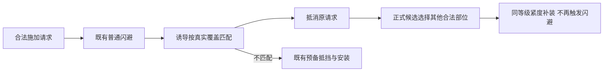

# 角色2：小魔女

本文件是角色2（稳定ID `witch`）的专属真源：身份与资源、施法预备与精神集中、初始牌组、专属卡牌覆盖值与过滤规则。基础卡牌的通用数值与卡池见 `./cards.md`；共用玩法规则见 `./game-design.md`。角色2 的同名改单使用独立 `witch_` 定义，不修改角色1 的同名牌。

代码真源：`core/witch_character.gd`、`core/witch_expansion.gd`、`data/card_rules.gd`。

### 淫魔法卡牌适配

「心痒难耐」「自我满足」「心理暗示」「强打精神」「爱欲魔纹」「强制寸止」「强制高潮」均使用独立 `witch_` 版本。费用、品质、快感变化、抽牌和其他规则保持原值，原本获得蓄力的效果按相同层数改为精神集中；爱欲魔纹拘束面因此每实际获得30快感获得1层精神集中，自由面仍每40快感抽1张。计量进度沿原跨回合机制，原版卡牌和能力定义不改写。独立卡面复用原卡图片，文案按角色显示。

这些卡牌沿 [淫魔法卡池](cards.md) 的持有门槛开放；欲望魔方的角色来源及Boss赠送规则见 [遗物](game-design.md)。

## 1. 身份与选择

- 主菜单角色1显示「魔法少女(futa)」，角色2显示「小魔女·测试版」；选择后开始新游戏，继续游戏按存档角色恢复；旧存档默认角色1。
- 图鉴页面内可选择魔法少女或小魔女，卡牌及遗物按所选角色过滤；选择只影响图鉴，不切换对局角色，也不读取实时状态。
- 角色1 保留原规则；角色2 在战场按真实站／坐／躺姿势切换三张立绘，左侧身体栏使用站姿原图的窄裁版。暂无小魔女拘束差分，佩戴拘束具仍用对应姿势默认立绘，规则判定不受图片影响。

## 2. 初始资源与遗物

| 项目 | 角色2 值 |
| --- | --- |
| 初始／上限魔力 | 75／75 |
| 初始／上限快感 | 75／75 |
| 魔瓶携带魔力 | 50 |
| 初始遗物 | 魔女护符：战斗中每回合开始获得1层魔力预备（含首回合） |
| 专属遗物 | 辣椒炒肉拌面：战斗开始时获得2层精神集中 |

角色2 不再提供闪耀的灯球、奥利哈基米、魔力耳坠、断缚护腕与余烬护符（`witch_character.gd::relic_allowed`）；角色1 不获得角色2 专属遗物。既有存档不重置魔力上限或重新发放初始资源，初始属性变更从新局生效。

## 3. 施法预备与释放

每个部位每回合预备次数不限；成功释放每部位限1次，失败保留释放次数。各部位独立计数，下一玩家回合重置；不能通过翻面、再次预备、选另一个敌人或读档刷新。

- 施法预备：1能量、5魔力，成功获得1层（层数无上限）；右键在“预备／释放”间切换，也可拖动动作到目标。动作标题显示“手部施法”等简称与“预备0→1”；副行仅显示实际能量、魔力和成功率，不重复部位与当前层数。小魔女的探索／牢房动作栏不显示角色1火球术或其占位，核心也不提供该火球自解候选。
- 释放消耗该部位全部施法预备，释放后按钮自动切回预备；无预备时手部／嘴部／精神仍可释放基础一段，腿部不可以。
- 整次动作只判定一次成功率；失败保留施法预备、失去1层精神集中，并按既有规则返还50%耗魔。
- 释放消耗全部该部位施法预备（魔女飞踹同样清空）。部位乘区与施法条件：手部沿原手部施法资格、嘴部沿原口部倍率、精神不要求身体部位但仍受快感影响、腿部把原腿部受限倍率计入成功率。

| 部位 | 1层／2层／4层名称 | 能量／魔力 | 基础伤害 |
| --- | --- | --- | --- |
| 手部 | 火焰箭／2层烈焰箭／4层炎枪术 | 1／5 | 6×（当前层数＋1），单体 |
| 嘴部 | 吹雪／2层冰风／4层暴风雪 | 2／10 | 4×（当前层数＋1），全体 |
| 精神 | 思维侵入／2层思维扰乱／4层思维破坏 | 1／5 | 4×（当前层数＋1），单体 |
| 腿部 | 魔女飞踹！ | 1／0 | 1，打断；至少4层可用 |

- 抵挡拘束：对应区域将被施加拘束时，消耗2层该区域施法预备抵消整件施加。真实合法位置先确定，复合件按真实覆盖区域判断；原有闪避优先。精神无实体装备目标。
- 四部位施法预备在高潮或本场整备结束时清空；“耐心耐心～”生效期间不消耗施法预备，也不能用预备抵挡拘束。保护覆盖本次行动结束后的敌方行动，在下回合开始、回合开始的装备效果结算前失效；本场结束仍照常清理。

“耐心耐心～”沿用统一增益清理入口，以 `next_turn_start` 声明失效时点，回合末不清除；状态栏持续时间读取同一声明，不另设计时器或保存字段。

- 精神集中：下一次造成魔法伤害时每层使各段基础伤害＋1，整次用完全部层数，魔法滑脱同样适用；施法失败或高潮时失去1层。本场整备结束最多保留2层（乌龟壳提高到4层），场内不限层数。
- 魔术手自由面在该角色下为闪避2（不再忽略手部拘束）。

## 4. 初始11张牌

3张顾涌！、3张用力！、1张魔力松缚、1张脱缚练习，以及三张专属基础牌（不随机出现、不入奖励池）。顾涌！双面保留；用力！自由面为精神集中1。

| 卡牌 | 费用 | 效果 |
| --- | --- | --- |
| 魔法钥匙 | 1能量，精神施法 | 自由面：获得4层魔力预备；拘束面：开锁1 |
| 施法预备 | 1能量、20魔力，精神施法 | 双面：获得4层魔力预备、2层精神集中 |
| 魔力积蓄 | 3能量，能力 | 双面：每点当前自身与临时魔力使造成伤害＋1% |

- 魔力积蓄按实际造成伤害时的自身与临时魔力总和计算，支付耗魔后再计算攻击加伤，与其他伤害倍率相乘；能力持续至整备结束，可叠加。
- 脱缚练习两面分别挣扎／滑脱，单张实体牌两面共享本局累计次数，整张结算完成只计1次，跨战斗保留。鼠标悬浮简介显示该实体牌的累计／下一门槛次数、距离升级次数；40次起显示全部升级完成。第10／20／30／40次用完后永久进化，当前这次仍按出牌时阶段逐段结算，进化后永久卡组与各牌堆实体一致。

| 阶段 | 段数×伤害 | 费用 |
| --- | --- | --- |
| 基础 | 1×3 | 1能量 |
| 10次后 | 1×6 | 1能量 |
| 20次后 | 2×6，顺延 | 1能量 |
| 30次后 | 3×6，顺延 | 1能量 |
| 40次后 | 3×6，顺延 | 0能量 |

×表示独立段数，每段复核目标与乘区；顺延复用同部位→同大部位→同区域规则；图鉴同页列出各进化阶段。

## 5. 角色2 专属卡牌与覆盖值

下表只列变化，未列出的费用、要求与附加效果沿原牌；未注明身体条件的魔法按无部位施法，但仍判定成功率。

| 牌 | 自由面 | 拘束面 |
| --- | --- | --- |
| 魔术手（含遗物赠牌） | 1能量、30魔力，闪避2 | 1能量、30魔力，降紧4，超级顺延 |
| 魔力松缚 | 魔力预备2（仍抽1） | 保留 |
| 汲取 | 恢复10魔力，抽1 | 恢复10魔力，消耗 |
| 蓄势待发 | 下一次基础动作费用−2 | 精神集中3 |
| 魔路检索 | 双面0能量、5魔力，消耗，精神施法 | 同左 |
| 激发魔力 | 恢复10魔力，魔力预备4 | 同左 |
| 魔力涌流 | 保留 | 0能量、20魔力，精神集中2 |
| 灵活变通 | 每回合开始魔力预备2 | 每回合开始精神集中1 |
| 魔力转换 | 恢复20魔力 | 消耗20魔力，能量＋2 |
| 找准松处 | 保留 | 精神集中1，仍抽1 |
| 魔力回路 | 保留 | 每累计耗魔20，精神集中1 |
| 欲能转换 | 每15快感获得1能量 | 同左 |

蓄势待发双面仍须选择并消耗1张手牌，仅施法成功消耗；减费最低0、一次用尽。

| 专属新牌 | 自由面 | 拘束面 |
| --- | --- | --- |
| 魔力抽调·普通 | 1能量无部位魔法，获得4层魔力预备 | 0费技能，至多消耗40魔瓶魔力等量恢复自身（按瓶余量与缺口封顶） |
| 耐心耐心～·罕见 | 1能量、25魔力，无部位魔法，嘴部装备等级＜3，下回合额外3能量 | 0费技能，直到下回合开始不消耗施法预备，暂停预备抵挡拘束；释放和高潮也保留预备 |
| 忍耐·罕见 | 0费消耗技能，下回合快感获取×0.5 | 0费消耗技能，本回合及下回合快感获取×0.5，加入1张本场临时敏感到弃牌堆 |
| 杂鱼♡～杂鱼♡～·稀有 | 1能量、20魔力，无部位魔法，下次手部基础法术释放附加一次打断 | 2能量、10魔力，无部位魔法，下次嘴部基础法术释放附加一次打断 |
| 窃取权柄·稀有能力 | 0费、60魔力，获得3能量、8层魔力预备、3层精神集中，清空快感，本回合快感获取×0.5；各部位合计紧度≤3 | 0费、60魔力，解除全部拘束与捕缚，清空快感，本回合快感获取×0.5 |

### 拘束诱导

小魔女专属罕见技能牌，双拘束面均0费，正常弃牌。拘束1：直到下回合开始，闪避所有嘴部拘束；拘束2：直到下回合开始，闪避所有手部区域拘束（沿小魔女既有手部预备抵挡区域：大臂、小臂、手腕、手掌、手指）。每次由诱导成功闪避，身体其他合法部位随机增加一件普通拘束具，等级与紧度继承被闪避请求。

两面可共存，同面不叠加；普通闪避先处理，诱导先于施法预备抵挡。整件合法请求的真实覆盖含受保护部位时抵消整件，补装仅1件。补装使用正式生成／安装接口，不替换现有装备，排除原件覆盖及当前受诱导保护的区域；补装本身不再触发闪避或消耗预备。无其他合法位置时，仅抵消原施加。主动佩戴的卡牌代价不被诱导拦截。回合末保留，直到下一玩家回合开始清除；场次结束清除，存档保持原持续状态。

- 忍耐与窃取权柄的减半属于快感获取乘区，同一时段重复不叠加，只补足持续回合；命运同担的均分不受影响。
- 杂鱼的打断不消耗预备动作，下一次成功释放消耗；群体法术对各敌人各打断一次，同意图不重复叠加。
- 窃取权柄只能在战斗使用，两面卡面“锁定回合结束按钮！”单独标红；生效后结束回合按钮禁用并显示锁链／锁头纹样，胜利离开战斗后去除；实际阻止正常结束回合与强制状态的继续回合候选，仍可行动与投降；战斗胜利后正常领取奖励。
- 新奖励牌通过角色卡池进入商店、战斗、事件及开局奖励；效果、释放限次与临时增益随场次清理，进化次数随实体卡保存。

## 6. 卡池、身体与存档

- 按用户列表移除：魔力撑隙、借力打力、翘腿无视、连续挣、余火、死灰复燃、控火、强力肘击、绷紧再挣、余势复演、猛火下山、炫火、术式解锁、扯开缺口、接连挣动、灌注、火动力学、火焰精通、般若汤及其衍生牌。其余卡牌任一面涉及未兼容的旧施法预备、专属体术或火球机制时整牌排除（`witch_character.gd::REMOVED/CHANGED/incompatible`）。
- 奖励、商店、事件取牌及开局变牌共用过滤与角色映射；授牌遗物不能绕过过滤。
- 任一牌面或关联增益涉及力量加成、按拘束件数获得力量或力量条件时，整张牌不进入小魔女卡池与图鉴；包括汇流、活动媚肉、紧缚爱好、拘束就是力量！、鲤鱼打挺。只含灵巧或魔力效果不因此排除，角色1卡池不受影响。
- 力量遗物同样不进入小魔女遗物池与图鉴：体术书、魔血、护腕；固定力量加成按遗物效果字段过滤，护腕的条件力量按稳定ID排除。奖励、商店、直接授予及百变怪变形共用角色资格判定，角色1不受影响。
- 角色2 删除 `special_2` 身体组和全部子部位，安装资格与界面同时移除；对应专用开局选项不可用。其他身体部位、姿势、层级、容量、材料与装备规则保持。
- 存档记录独立身份、四部位层数、精神集中与角色2专属卡牌实例计数；快照拒绝非法层数、互斥双面共存与保留其他角色专属卡的状态。不迁移旧局初始卡组。
- 精神集中与施法预备的保留、清空入口复用共用场次与高潮管线，不新建第二套回合或结算流程。

## 7. 实现与验证入口

规则通过原候选、支付、施法随机、事务提交与固定点执行，没有新命令旁路。规则用例归 `witch_character`、`card_expansion`、`card_splash`、`pressure`、`persistence`、`rewards`、`encyclopedia`、`architecture` 与 `localization`；窗口归 `encyclopedia`、`home`、`localization`。检查命令见 `.zcode/skills/repo-ops/SKILL.md`。
